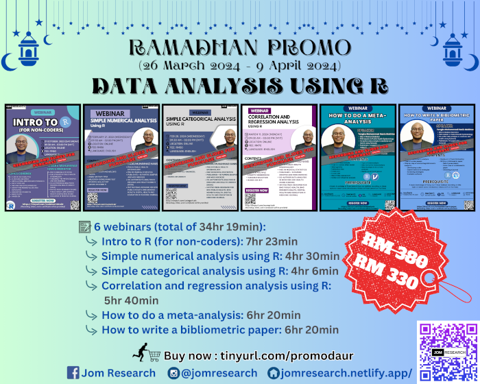

**THIS OFFER HAS ENDED**

The recording and slides for this Ramadhan promo is available for purchase:

- Title: Data analysis using R
- Price: RM330 (non-promo price RM380)
- Content:

| Title | Duration | Contents | 
|-------|----------|----------|
| Intro to R (for non-coders) | 7hr 23min | 1) Flow of data analysis, 2) R, RStudio, and Posit, 3) Installation, updates, and R packages, 4) Data types in R, 5) Indexing and data wrangling, 6) Identifying missing values and duplicates, 7) Descriptive statistics, 8) Basic plots, 9) Hands-on in R
| Simple numerical analysis using R | 4hr 30min | 1) Independent t-test and Welch's t-test, 2) Paired t-test, 3) One-way ANOVA and Welch's ANOVA, 4) Mann-Whitney test, 5) Wilcoxon signed-rank test, 6) Kruskal Wallis test, 7) Hands-on using R
| Simple categorical analysis using R | 4hr 6min | 1) Odds ratio, risk ratio, and confounder, 2) Pearson’s chi-square test, 3) Fisher’s exact test, 4) McNemar’s test, 5) Cochran’s Q test, 6) Cochran-Mantel-Haenszel test, 7) Hands-on using R
| Correlation and regression analysis using R | 5hr 40min | 1) Spearman correlation, 2) Pearson correlation, 3) Simple & multiple linear regression, 4) Simple & multiple logistic regression, 5) Variable selection, 6) Related concepts such as interaction, outliers, and multicollinearity, 7) Hands-on using R
| How to do a meta-analysis | 6hr 20min | 1) What is a meta-analysis, 2) Fixed vs random effect model, 3) Heterogeneity, 4) Publication bias, 5) Forest plot, 6) Funnel plot, 7) Risk of bias assessment, 8) Outlier and influential analysis, 9) Type of meta-analysis, 10) Data format for meta-analysis, 11) Step-by-step to do a meta-analyis, 12) Hands-on in R and jamovi
| How to write a bibliometric paper | 6hr 20min | 1) Theory and concept of bibliometric analysis, 2) Planning and writing a bibliometric paper, 3) Running the bibliometric analysis, 4) Hands-on in Web of Science database, R and biblioshiny

[Go to Offers](https://jomresearch.netlify.app/offers/)