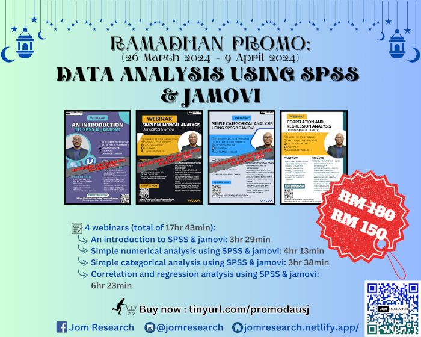

**THIS OFFER IS ONGOING**

The recording and slides for this Ramadhan promo is available for purchase:

- Title: Data analysis using SPSS & jamovi
- Price: RM150 (non-promo price RM180)
- [Click to buy](https://forms.gle/FUT3ebNns2cUZmjS6)
- Content:

| Title | Duration | Contents | 
|-------|----------|----------|
| An introduction to SPSS & jamovi | 3hr 29min | 1) Basic functionalities of the software, 2) Data exploration, 3) Flow of data analysis, 4) Descriptive statistics, 5) Basic plots, 6) Hands-on using both software
| Simple numerical analysis using SPSS & jamovi | 4hr 13min | 1) Independent t-test and Welch's t-test, 2) Paired t-test, 3) One-way ANOVA and Welch's ANOVA, 4) Mann-Whitney test, 5) Wilcoxon signed-rank test, 6) Kruskal Wallis test, 7) Hands-on using both software
| Simple categorical analysis using SPSS & jamovi | 3hr 38min | 1) Odds ratio, risk ratio, and confounder, 2) Pearson’s chi-square test, 3) Fisher’s exact test, 4) McNemar’s test, 5) Cochran’s Q test, 6) Cochran-Mantel-Haenszel test, 7) Hands-on using both software
| Correlation and regression analysis using SPSS & jamovi | 6hr 23min | 1) Spearman correlation, 2) Pearson correlation, 3) Simple & multiple linear regression, 4) Simple & multiple logistic regression, 5) Variable selection, 6) Related concepts such as interaction, outliers, and multicollinearity, 7) Hands-on using both software

[Go to Offers](https://jomresearch.netlify.app/offers/)