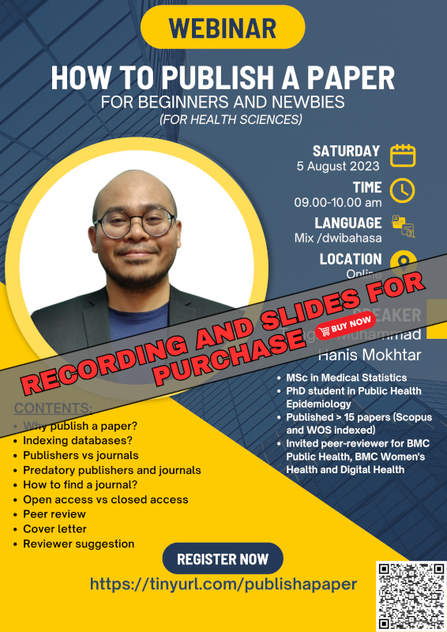

The recording and slides of this webinar is available for purchase:

- Title: How to publish a paper for beginners and newbies (for health sciences)
- Language: English
- Price: RM10
- Content: 
    - Why publish a paper?
    - Indexing databases?
    - Publishers vs journals
    - Predatory publishers and journals
    - How to find a journal?
    - Open access vs closed access 
    - Peer review 
    - Cover letter 
    - Reviewer suggestion
- [Click here to buy](https://docs.google.com/forms/d/e/1FAIpQLSe-Q16oiKxp1Suz1fOH8Rqebh-qZri303E3POjUlpTPfD50oA/viewform)

[Go to past webinars](https://jomresearch.netlify.app/webinars/#past-webinars)