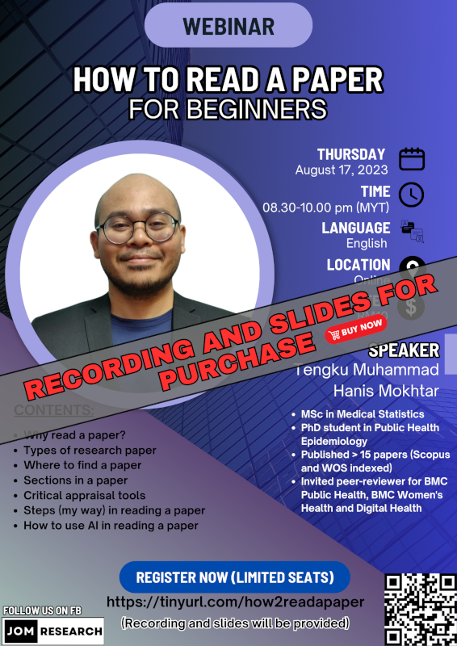

The recording and slides of this webinar is available for purchase:

- Title: How to read a paper for beginners
- Price: RM10
- Content: Refer to poster below
- [Click here to buy](https://docs.google.com/forms/d/e/1FAIpQLSeM8faF-oMyIbodmpbl7hgB3FFOKMogCQpZy3aDhouD70TIlA/viewform)

[Go to past webinars](https://jomresearch.netlify.app/webinars/#past-webinars)