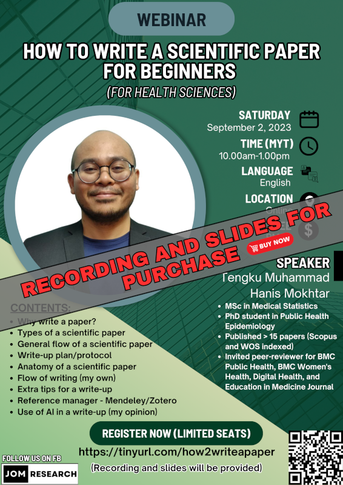

The recording and slides of this webinar is available for purchase:

- Title: How to write a scientific paper for beginners (for health sciences)
- Language: English
- Price: RM30
- Content: 
    - Why write a paper?
    - Types of a scientific paper
    - General flow of a scientific paper
    - Write-up plan/protocol
    - Anatomy of a scientific paper
    - Flow of writing (my own)
    - Extra tips for a write-up
    - Reference manager - Mendeley/Zotero
    - Use of AI in a write-up (my opinion)
- [Click here to buy](https://docs.google.com/forms/d/e/1FAIpQLSeEaEa0n3SLl_s9JX8oNjL96QSrik58CP5uao5DViDiIhSF2Q/viewform)

[Go to past webinars](https://jomresearch.netlify.app/webinars/#past-webinars)