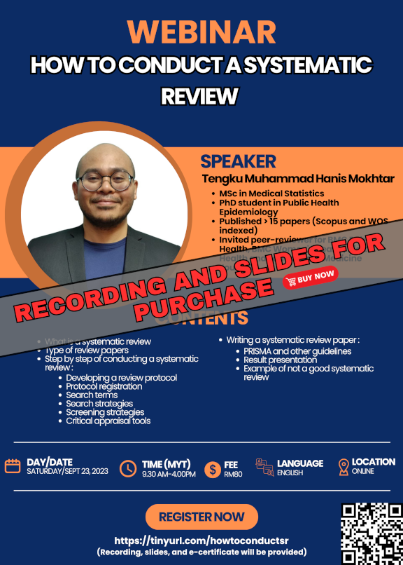

The recording and slides of this webinar is available for purchase:

- Title: How to conduct a systematic review
- Language: English
- Price: RM80 (recording, slides, and e-certificate are included)
- Content: 
    - What is a systematic review
    - Type of review papers
    - Step by step of conducting a systematic review:
        - Developing a review protocol
        - Protocol registration 
        - Search terms
        - Search strategies 
        - Screening strategies 
        - Critical appraisal tools
    - Writing a systematic review paper:
        - PRISMA and other guidelines
        - Result presentation
        - Example of not a good systematic review 
- [Click to buy](https://forms.gle/uN6aWTCwnBPzktEM7)

[Go to past webinars](https://jomresearch.netlify.app/webinars/#past-webinars)