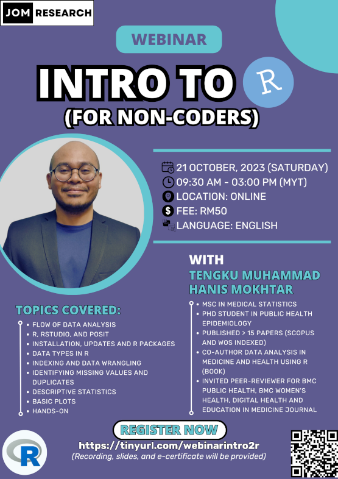

**This webinar is open for registration**

- Title: Intro to R (for non-coders)
- Date: Oct 21, 2023 (Saturday)
- Time: 09.30am - 03.00pm (MYT)
- Language: English
- Fee: RM50 (recording, slides, and e-certificates will be provided)
- Location: Online (Google Meet)
- Content: 
    - Flow of data analysis
    - R, RStudio, and Posit
    - Installation, updates, and R packages
    - Data types in R
    - Indexing and data wrangling
    - Identifying missing values and duplicates
    - Descriptive statistics
    - Basic plots
    - Hands-on
- [Click to register](https://forms.gle/eMcwB3FyFmRM5a466)

[Go to webinars](https://jomresearch.netlify.app/webinars/)