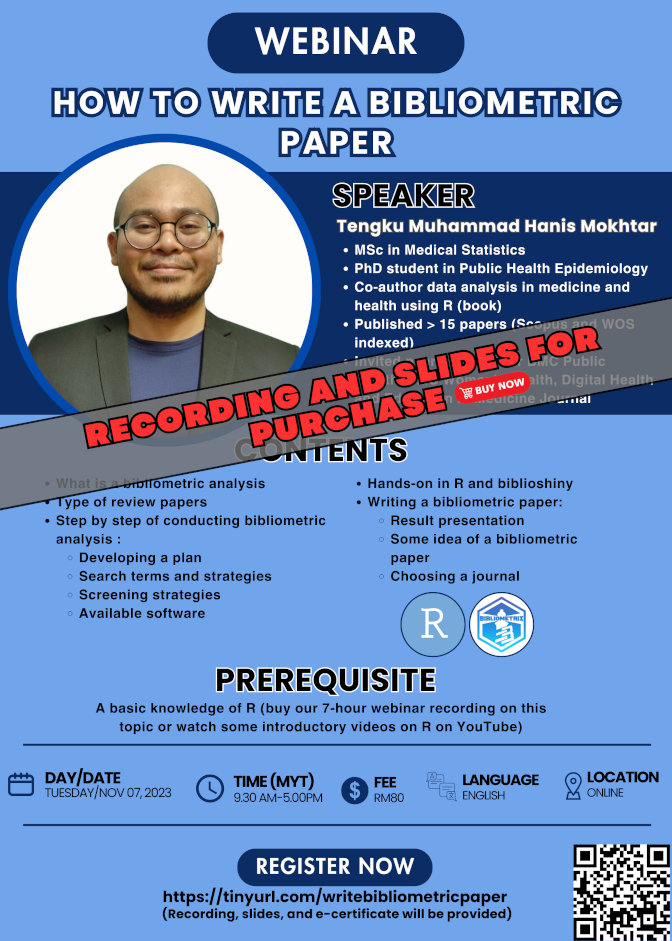

The material for this webinar is available for purchase:

- Title: How to write a bibliometric paper
- Language: English
- Price: RM80 (6-hour recording, slides, dummy data, and R codes/scripts)
- Prerequisite: Basic knowledge of R. For those new to R, you can either:
    - Buy our 7-hour webinar recording, "Intro to R (for non-coders): [RM50] https://tinyurl.com/recordingintrotor
    - Watch some introductory videos on R on YouTube
- Content: 
    1. Theory and concept of bibliometric analysis
    2. Planning and writing a bibliometric paper
    3. Running the bibliometric analysis
    4. Hands-on in Web of Science database, R and biblioshiny
- [Click to buy](https://forms.gle/PNr6uyh7KAHRAGMXA)

[Go to past webinars](https://jomresearch.netlify.app/webinars/#past-webinars)

