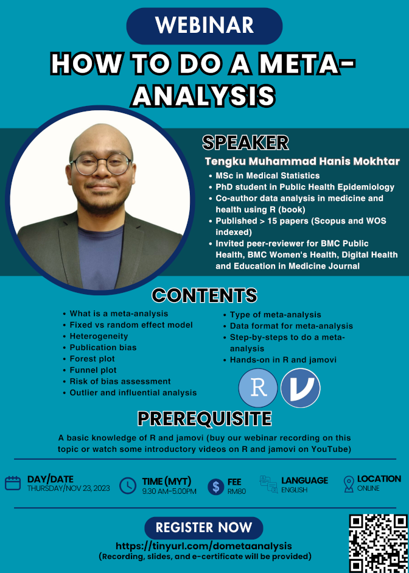

**This webinar is open for registration**

Please find the details of the webinar below:

- Title: How to do a meta-analysis
- Date: Nov 23, 2023 (Thursday)
- Time: 09.30 am-05.00 pm (MYT)
- Language: English
- Fee: RM80 (recording, slides, and e-certificates will be provided)
- Location: Online (Google Meet)
- Prerequisite: Basic knowledge of R and jamovi, you can either:
    - Buy our webinars' recording:
        1. Intro to R (for non-coders): [RM50] https://tinyurl.com/recordingintrotor
        2. An introduction to SPSS & jamovi: [RM30] https://tinyurl.com/recordingintrospssjamovi
    - Or watch some introductory videos on R and jamovi on YouTube
- Content: 
    1. What is a meta-analysis
    2. Fixed vs random effect model
    3. Heterogeneity
    4. Publication bias
    5. Forest plot
    6. Funnel plot
    7. Risk of bias assessment
    8. Outlier and influential analysis
    9. Type of meta-analysis
    10. Data format for meta-analysis
    11. Step-by-step to do a meta-analyis
    12. Hands-on in R and jamovi
- [Click to register](https://forms.gle/Q3PovN8kP3kgCA4Q9)

[Go to webinars](https://jomresearch.netlify.app/webinars/)