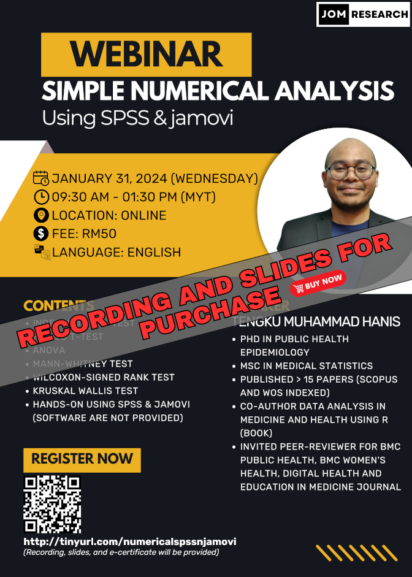

The material for this webinar is available for purchase:

- Title: Simple numerical analysis using SPSS & jamovi
- Language: English
- Price: RM50 (recording, slides, and dummy data)
- Prerequisite: Basic knowledge of SPSS and jamovi, you can either:
    - Buy our webinars' recording - [an introduction to SPSS & jamovi -  RM30](https://tinyurl.com/recordingintrospssjamovi)
    - Or watch some introductory videos on SPSS & jamovi on YouTube
- Content: 
    1. Independent t-test and Welch's t-test
    2. Paired t-test
    3. One-way ANOVA and Welch's ANOVA
    4. Mann-Whitney test
    5. Wilcoxon signed-rank test
    6. Kruskal Wallis test
    7. Hands-on using spss & jamovi (software are not provided)
- [Click to buy](https://forms.gle/hGRaaVaRD424dtPQ7)

[Go to past webinars](https://jomresearch.netlify.app/webinars/#past-webinars)