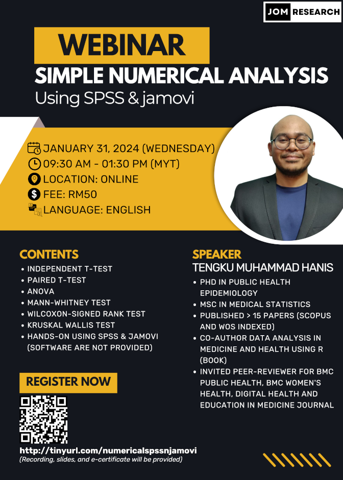

This webinar is open for registration:

- Title: Simple numerical analysis using SPSS & jamovi
- Date: Jan 31, 2024 (Wednesday)
- Time: 09.30 am-01.30 pm (MYT)
- Language: English
- Price: RM50 (recording, slides, dummy data, and e-certificate)
- Prerequisite: Basic knowledge of SPSS and jamovi, you can either:
    - Buy our webinars' recording - [an introduction to SPSS & jamovi -  RM30](https://tinyurl.com/recordingintrospssjamovi)
    - Or watch some introductory videos on SPSS & jamovi on YouTube
- Content: 
    1. Independent t-test
    2. Paired t-test
    3. One-way anova
    4. Mann-whitney test
    5. Wilcoxon-signed rank test
    6. Kruskal wallis test
    7. Hands-on using spss & jamovi (software are not provided)
- [Click to register](http://tinyurl.com/numericalspssnjamovi)

[Go to webinars](https://jomresearch.netlify.app/webinars/)