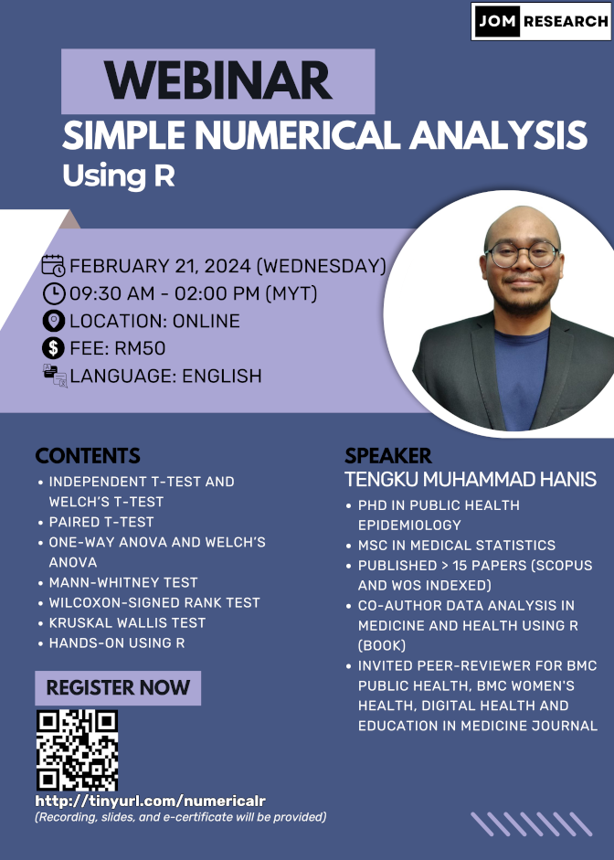

This webinar is open for registration:

- Title: Simple numerical analysis using R
- Date: Feb 21, 2024 (Wednesday)
- Time: 09.30 - 02.00 pm (MYT)
- Language: English
- Fee: RM50 (recording, slides, and e-certificates will be provided)
- Location: Online (Google Meet)
- Prerequisite: Basic knowledge of R, you can either:
    - Buy our webinar recording [Intro to R (for non-coders) -  RM50: https://tinyurl.com/recordingintrotor]
    - Or watch some introductory videos on R on YouTube
- Content: 
    1. Independent t-test and Welch's t-test
    2. Paired t-test
    3. One-way ANOVA and Welch's ANOVA
    4. Mann-Whitney test
    5. Wilcoxon signed-rank test
    6. Kruskal Wallis test
    7. Hands-on using R
- [Click to register](http://tinyurl.com/numericalr)

[Go to webinars](https://jomresearch.netlify.app/webinars)