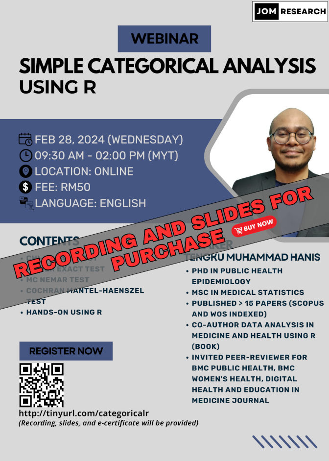

The material for this webinar is available for purchase:

- Title: Simple categorical analysis using R
- Language: English
- Fee: RM50 (recording, slides, and e-certificates will be provided)
- Prerequisite: Basic knowledge of R, you can either:
    - Buy our webinar recording [Intro to R (for non-coders) -  RM50: https://tinyurl.com/recordingintrotor]
    - Or watch some introductory videos on R on YouTube
- Content: 
  1. Odds ratio, risk ratio, and confounder
  2. Pearson’s chi-square test
  3. Fisher’s exact test
  4. McNemar’s test
  5. Cochran’s Q test
  6. Cochran-Mantel-Haenszel test
  7. Hands-on using R

- [Click to buy](https://forms.gle/kbSFAX8MtfRPaVC79)

[Go to past webinars](https://jomresearch.netlify.app/webinars/#past-webinars)