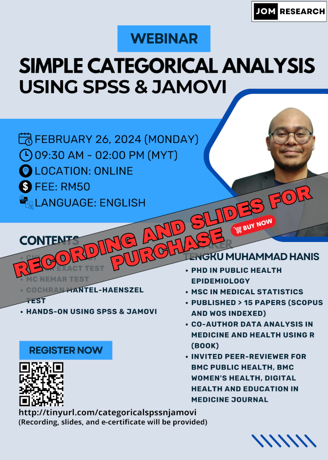

This webinar is open for registration:

- Title: Simple categorical analysis using SPSS & jamovi
- Date: Feb 26, 2024 (Monday)
- Time: 09.30 - 02.00 pm (MYT)
- Language: English
- Fee: RM50 (recording, slides, and e-certificates will be provided)
- Location: Online (Google Meet)
- Prerequisite: Basic knowledge of SPSS and jamovi, you can either:
    - Buy our webinars' recording - [an introduction to SPSS & jamovi -  RM30](https://tinyurl.com/recordingintrospssjamovi)
    - Or watch some introductory videos on SPSS & jamovi on YouTube
- Content: 
    1. Chi-square test
    2. Fisher exact test
    3. Mc Nemar test
    4. Cochran Mantel-Haenszel test
    5. Hands-on using SPSS and jamovi
- [Click to register](http://tinyurl.com/categoricalspssnjamovi)

[Go to webinars](https://jomresearch.netlify.app/webinars)