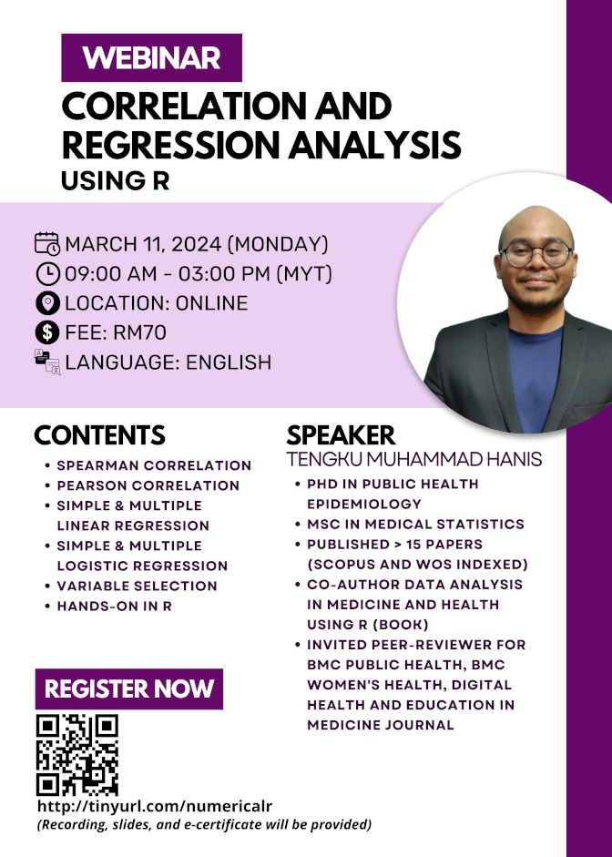

**This webinar is open for registration.**

- Title: Correlation and regression analysis using R
- Date: March 11, 2024 (Monday)
- Time: 09.00 am-03.00 pm (MYT)
- Location: Google Meet
- Language: English
- Fee: RM70 (recording, slides, dummy data, R codes, and e-certificate)
- Prerequisite: Basic knowledge of R, for those without the basics, you can either:
    - Buy our webinar recording [Intro to R (for non-coders) -  RM50](https://tinyurl.com/recordingintrotor)
    - Or watch some introductory videos on R on YouTube
- Content: 
    1. Spearman correlation
    2. Pearson correlation
    3. Simple & multiple linear regression
    4. Simple & multiple logistic regression
    5. Variable selection
    6. Hands-on using R
- [Click to register](https://tinyurl.com/crausingr)

[Go to webinars](https://jomresearch.netlify.app/webinars)