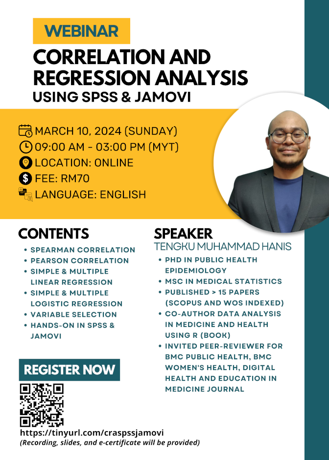

**This webinar is open for registration.**

- Title: Correlation and regression analysis using SPSS & jamovi
- Date: March 10, 2024 (Sunday)
- Time: 09.00 am-03.00 pm (MYT)
- Location: Google Meet
- Language: English
- Fee: RM70 (recording, slides, dummy data, and e-certificate)
- Prerequisite: Basic knowledge of SPSS and jamovi, for those without the basics, you can either:
    - Buy our webinars' recording - [an introduction to SPSS & jamovi -  RM30](https://tinyurl.com/recordingintrospssjamovi)
    - Or watch some introductory videos on SPSS & jamovi on YouTube
- Content: 
    1. Spearman correlation
    2. Pearson correlation
    3. Simple & multiple linear regression
    4. Simple & multiple logistic regression
    5. Variable selection
    6. Hands-on using SPSS and jamovi
- [Click to register](https://tinyurl.com/craspssjamovi)

[Go to webinars](https://jomresearch.netlify.app/webinars)