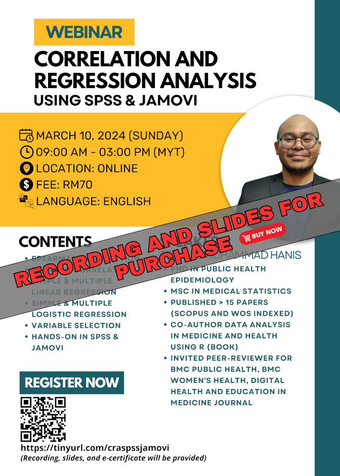

The material for this webinar is available for purchase:

- Title: Correlation and regression analysis using SPSS & jamovi
- Language: English
- Price: RM70 (recording, slides, and dummy data)
- Prerequisite: Basic knowledge of SPSS and jamovi, for those without the basics, you can either:
    - Buy our webinars' recording - [an introduction to SPSS & jamovi -  RM30](https://tinyurl.com/recordingintrospssjamovi)
    - Or watch some introductory videos on SPSS & jamovi on YouTube
- Content: 
    1. Spearman correlation
    2. Pearson correlation
    3. Simple & multiple linear regression
    4. Simple & multiple logistic regression
    5. Variable selection process
    6. Related concepts such as interaction, outliers, and multicollinearity
    7. Hands-on using SPSS and jamovi
- [Click to buy](https://forms.gle/QMhHr4TstocwU6m3A)

[Go to past webinars](https://jomresearch.netlify.app/webinars/#past-webinars)