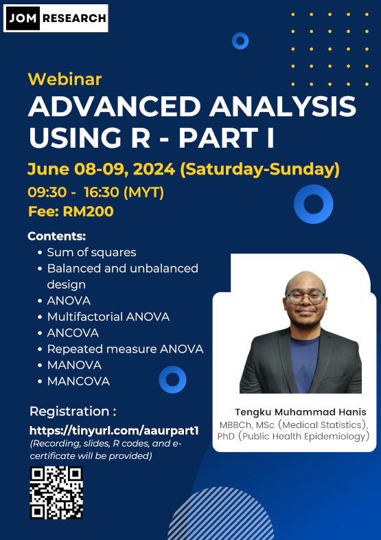

**This webinar is YET TO OPEN for registration**

- Title: Advanced analysis using R - Part 1
- Date: July 02-03, 2024 (Tuesday-Wednesday)
- Time: 09.30 am-04.30 pm (MYT)
- Language: English
- Fee: RM200 (recording, slides, dummy data, R codes, and e-certificates will be provided)
- Location: Online (Google Meet)
- Prerequisite: Basic knowledge of R, for those without the basics, you can either:
    - Buy our webinar recording [Intro to R (for non-coders) -  RM50](https://tinyurl.com/recordingintrotor)
    - Or watch some introductory videos on R on YouTube
- Content: 
    1. Sum of squares
    2. Balanced and unbalanced design
    3. ANOVA
    4. Multifactorial ANOVA
    5. ANCOVA
    6. Repeated measure ANOVA
    7. MANOVA
    8. MANCOVA
    9. Hands-on using R
- [Click to register](https://forms.gle/Lzdp9YYY8owEZKYS8)

[Go webinars](https://jomresearch.netlify.app/webinars/)