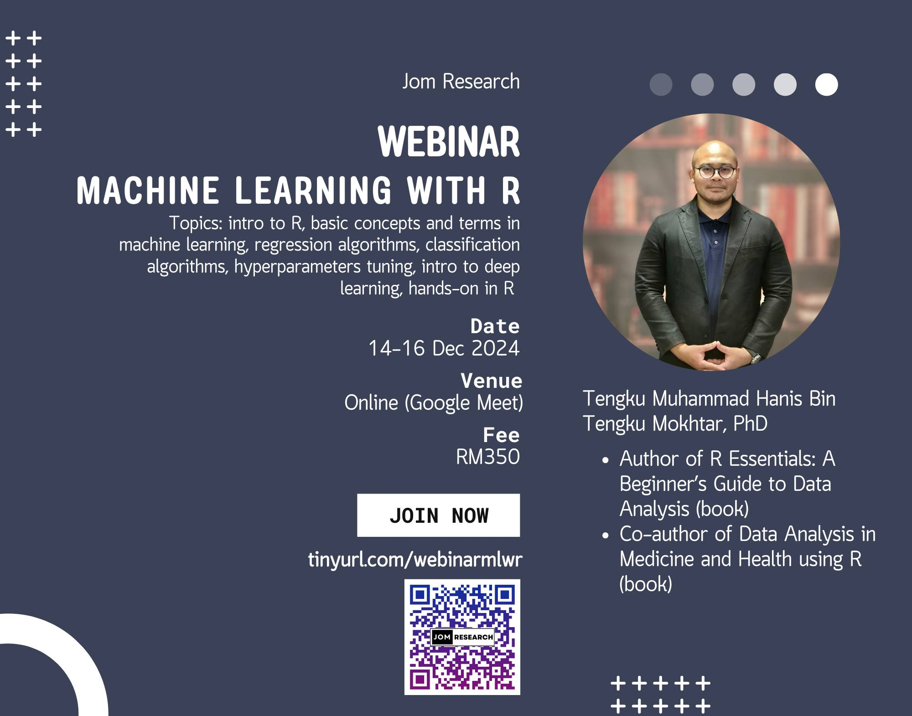

**This webinar is OPEN FOR REGISTRATION!**

-   Title: Machine learning with R
-   Date: Dec 14-16, 2024 (Saturday-Monday)
-   Time: 09.30am - 04.30pm (MYT)
-   Language: English
-   Location: Online (Google Meet)
-   Price: RM350 (recording, slides, R codes, dummy data, and e-certificates will be provided)
-   Content:
    1.  Introduction to R
    2.  Basic concepts and terms in machine learning
    3.  Regression algorithms
    4.  Classification algorithms
    5.  Hyperparameters tuning
    6.  Ensemble machine learning
    7.  Explainable machine learning
    8.  Introduction to deep learning
    9.  Hands-on session in R
-   [Click to register](https://forms.gle/6qLnGBqadhJyUs6N8)

[Go to webinars](https://jomresearch.netlify.app/webinars/)
